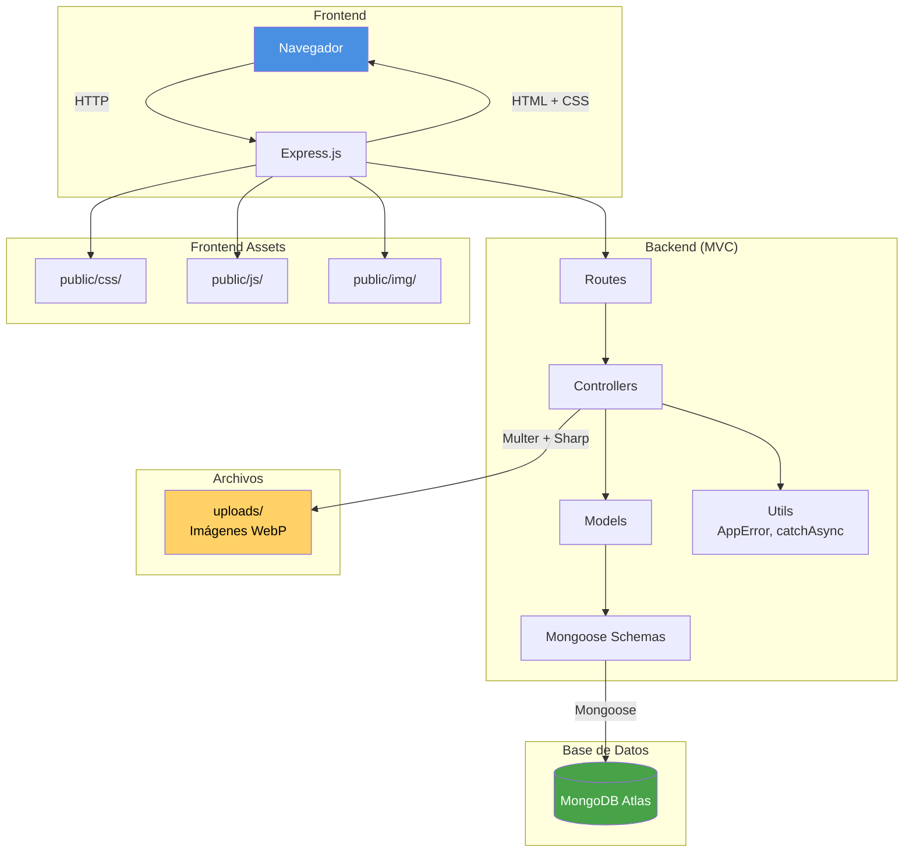
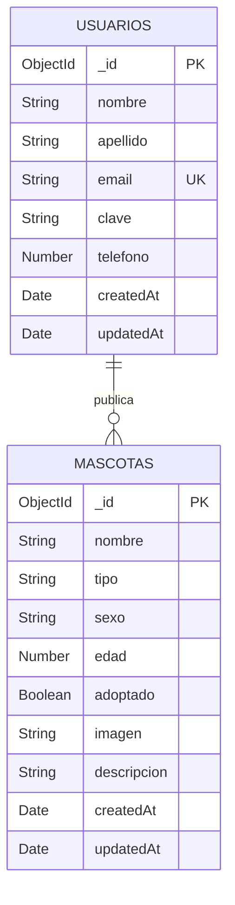
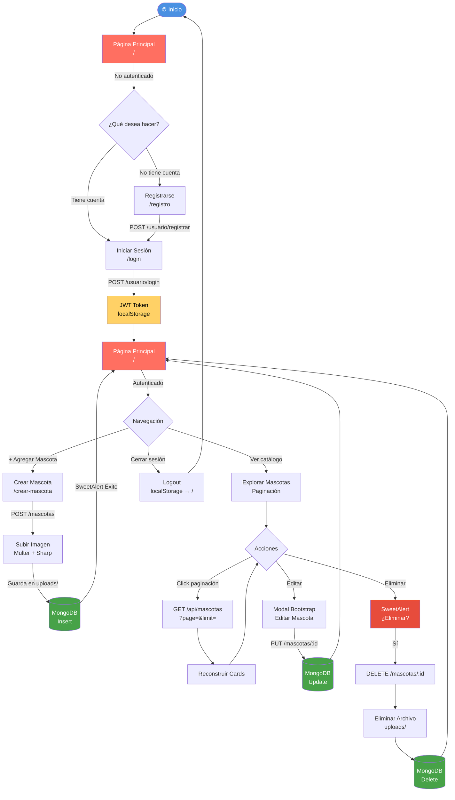
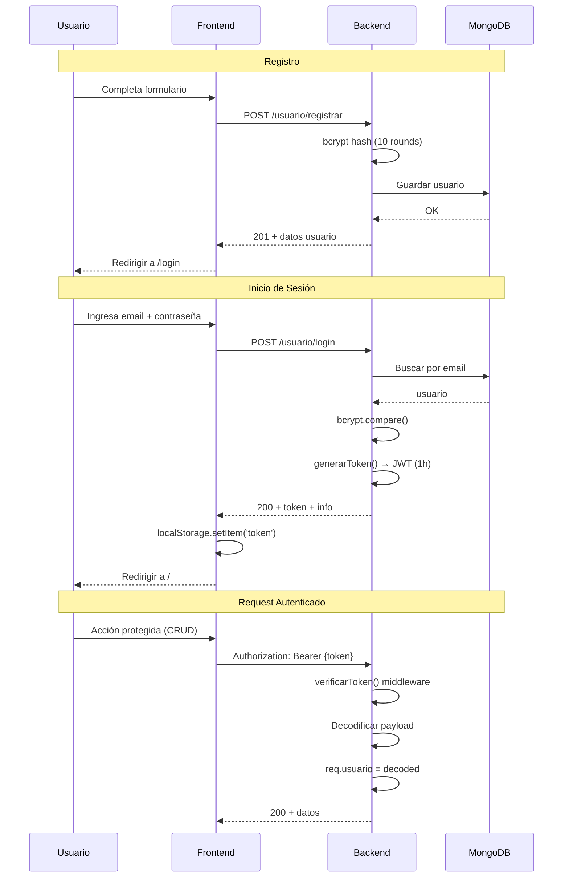

#  Animal Friends

Aplicación web fullstack para la adopción de mascotas. Permite a los usuarios registrarse, publicar mascotas disponibles para adopción, editarlas, eliminarlas y navegar por un catálogo paginado.


---

##  Características

- **CRUD completo** de mascotas (Crear, Leer, Editar, Eliminar)
- **Autenticación JWT** con registro e inicio de sesión
- **Paginación** del catálogo de mascotas
- **Subida de imágenes** con conversión automática a WebP (Sharp)
- **Diseño responsivo** con Bootstrap 5
- **Alertas interactivas** con SweetAlert2

---

##  Tecnologías

| Categoría | Tecnología |
|-----------|------------|
| Backend | Express.js 5, Node.js |
| Base de datos | MongoDB Atlas, Mongoose 9 |
| Motor de plantillas | Handlebars (hbs) |
| Autenticación | JWT, bcrypt |
| Subida de imágenes | Multer, Sharp |
| Frontend | Bootstrap 5, CSS custom, JavaScript vanilla |
| Alertas | SweetAlert2 |
| Gestor de paquetes | pnpm |

---

##  Arquitectura del Proyecto

El proyecto sigue el patrón **MVC** (Modelo-Vista-Controlador) con una capa adicional de schemas para Mongoose.



---

##  Base de Datos

La base de datos **adopcion** en MongoDB Atlas contiene dos colecciones:

### Diagrama Entidad-Relación



### Colección: usuarios

| Campo | Tipo | Requisito | Descripción |
|-------|------|-----------|-------------|
| `_id` | ObjectId | Auto | Identificador único |
| `nombre` | String | Requerido | Nombre del usuario |
| `apellido` | String | Requerido | Apellido del usuario |
| `email` | String | Requerido, único | Email (lowercase, trimmed) |
| `clave` | String | Requerido | Contraseña (hash bcrypt) |
| `telefono` | Number | Opcional | Número de teléfono |
| `createdAt` | Date | Auto | Fecha de creación |
| `updatedAt` | Date | Auto | Fecha de última actualización |

### Colección: mascotas

| Campo | Tipo | Requisito | Descripción |
|-------|------|-----------|-------------|
| `_id` | ObjectId | Auto | Identificador único |
| `nombre` | String | Requerido | Nombre de la mascota |
| `tipo` | String | Requerido | Tipo (Perro, Gato, Ave, Otro) |
| `sexo` | String | Requerido | Macho o Hembra (enum) |
| `edad` | Number | Requerido | Edad (0-30) |
| `adoptado` | Boolean | Default: false | Estado de adopción |
| `imagen` | String | Opcional | Ruta de la imagen (WebP) |
| `descripcion` | String | Opcional | Descripción de la mascota |
| `createdAt` | Date | Auto | Fecha de creación |
| `updatedAt` | Date | Auto | Fecha de última actualización |

---

##  Flujo del Usuario

### Flujo principal de navegación



### Flujo de autenticación



---

##  Instalación

### Prerrequisitos

- [Node.js](https://nodejs.org/) v18+
- [pnpm](https://pnpm.io/) v11+
- [MongoDB Atlas](https://www.mongodb.com/atlas) (cuenta gratuita)

### Pasos

1. **Clonar el repositorio**
   ```bash
   git clone https://github.com/gabboIng/Animal-Friends.git
   cd Animal-Friends
   ```

2. **Instalar dependencias**
   ```bash
   pnpm install
   ```

3. **Configurar variables de entorno**

   Crear archivo `.env` en la raíz:
   ```env
   PORT=5100
   SERVER_DB=tu_cluster.mongodb.net
   USER_DB=tu_usuario_db
   PASS_DB=tu_contraseña
   DB_HOSTS=host1:27017,host2:27017,host3:27017
   DB_REPLICA_SET=tu_replica_set
   DB_AUTH_SOURCE=admin
   db_Name=adopcion
   JWT_SECRET=tu_secreto_ultra_seguro
   ```

4. **Iniciar el servidor**
   ```bash
   node app.js
   ```

5. **Abrir en el navegador**
   ```
   http://localhost:5100
   ```

---

##  Estructura del Proyecto

```
Animal-Friends/
├── app.js                    # Punto de entrada
├── .env                      # Variables de entorno (no commitear)
├── package.json
│
├── config/
│   ├── dbClient.js           # Conexión MongoDB (Mongoose)
│   ├── multer.js             # Config subida de archivos
│   └── procesarImagen.js     # Conversión imágenes → WebP
│
├── controllers/
│   ├── mascotas.js           # CRUD mascotas
│   └── usuario.js            # Registro + Login
│
├── helpers/
│   └── autenticacion.js      # JWT: generarToken + verificarToken
│
├── middlewares/
│   └── errorHandler.js       # Manejo global de errores
│
├── models/
│   ├── mascotas.js           # Modelo mascotas (paginación, CRUD)
│   └── usuario.js            # Modelo usuarios
│
├── routes/
│   ├── mascotas.js           # API REST mascotas
│   ├── pages.js              # Rutas de páginas (HTML)
│   └── usuario.js            # API REST usuarios
│
├── schema/
│   ├── mascotas.js           # Schema Mongoose mascotas
│   └── usuarios.js           # Schema Mongoose usuarios
│
├── utils/
│   ├── AppError.js           # Clase error personalizada
│   └── catchAsync.js         # Wrapper async/await
│
├── public/
│   ├── css/                  # Estilos (shared, home, login, registro, crear-mascota)
│   ├── img/                  # Imágenes estáticas
│   └── js/                   # Scripts del cliente (paginador, login, registro, crear-mascota)
│
├── uploads/                  # Imágenes subidas (no commitear)
│
└── views/
    ├── home.hbs              # Página principal + catálogo + modal editar
    ├── login.hbs             # Inicio de sesión
    ├── registro.hbs          # Registro de usuario
    ├── crear-mascota.hbs     # Formulario crear mascota
    └── partials/
        ├── header.hbs        # Navbar (links condicionales)
        └── footer.hbs        # Footer + CDN SweetAlert2 + scripts
```

---

## 🌐 API Routes

### Páginas (HTML)

| Método | Ruta | Descripción |
|--------|------|-------------|
| `GET` | `/` | Página principal con catálogo paginado |
| `GET` | `/login` | Página de inicio de sesión |
| `GET` | `/registro` | Página de registro |
| `GET` | `/crear-mascota` | Formulario para crear mascota |

### Mascotas (API REST) — requiere JWT

| Método | Ruta | Descripción |
|--------|------|-------------|
| `GET` | `/mascotas` | Obtener todas las mascotas |
| `GET` | `/mascotas/:id` | Obtener una mascota |
| `POST` | `/mascotas` | Crear mascota (multipart/form-data) |
| `PUT` | `/mascotas/:id` | Actualizar mascota |
| `DELETE` | `/mascotas/:id` | Eliminar mascota + archivo |

### Paginación (pública)

| Método | Ruta | Parámetros | Descripción |
|--------|------|------------|-------------|
| `GET` | `/api/mascotas` | `page`, `limit` | Mascotas paginadas (JSON) |

### Usuarios (API REST)

| Método | Ruta | Descripción |
|--------|------|-------------|
| `POST` | `/usuario/registrar` | Registrar usuario |
| `POST` | `/usuario/login` | Iniciar sesión (devuelve JWT) |

---

##  Autor

**gabboIng** — [GitHub](https://github.com/gabboIng)
